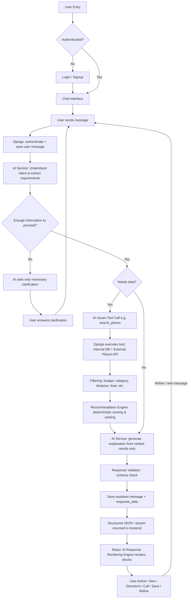
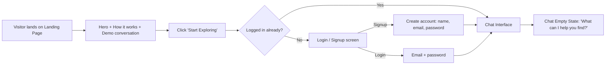
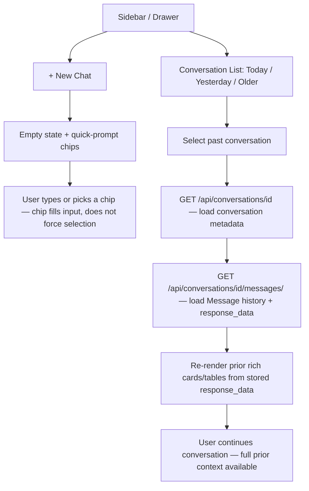
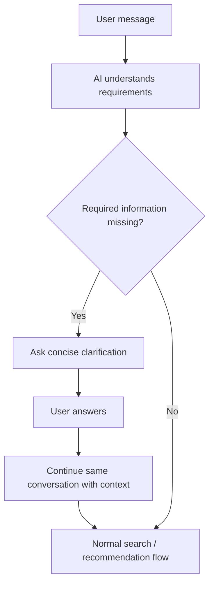
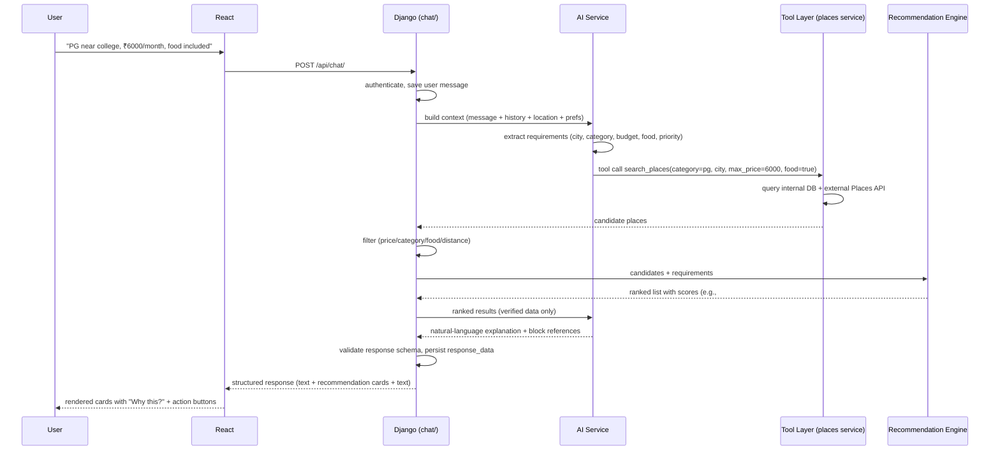
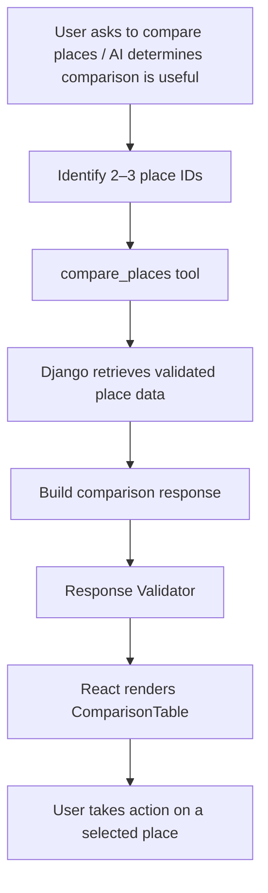
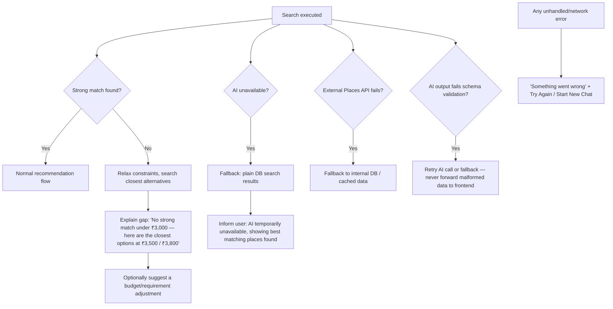
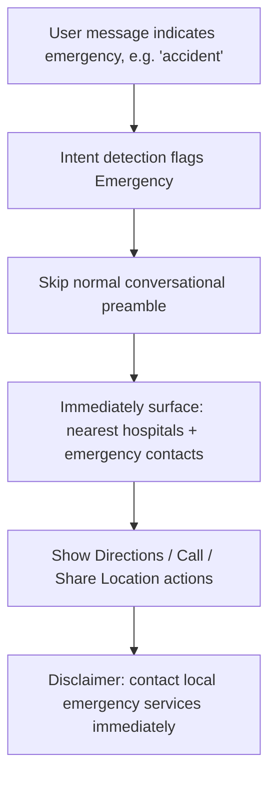

# City Companion — APP_FLOW.md

**Purpose:** Describes the end-to-end application flow — from user entry to action — and the major user journeys. This document is derived from `PRD.md` and `TRD.md` and does not introduce any new feature or architecture. Where a flow detail is not resolved in those documents, it is marked `[TBD]`.

**Legend:** ✅ MVP flow · 🔵 Future/Version 2 step (shown for context, not required at MVP) · `[TBD]` unresolved

---

## 1. Master Flow (End-to-End)

This is the backbone flow every request follows, per the TRD's core architecture (§2.1, §6.2, §11) and PRD §5–7.



Key rule carried from TRD §2.3: the AI never queries the database directly and never has final ranking authority — it understands, requests, and explains; the Recommendation Engine ranks; Django orchestrates everything. ✅

---

## 2. Landing → Login/Signup → Chat



Notes (PRD §7.5, §8.2–8.3):
- Landing page is a convincer only; the chat page **is** the product. ✅
- Returning logged-in users may skip straight to chat. [TBD — exact behavior = product decision]
- The "New to City" onboarding flow (Study/Work/Travel/Moving, with **Skip & Chat**) is 🔵 Version 2 / Future, not part of MVP.
- Auth is JWT-based; token sent on all subsequent requests (TRD §7). ✅

---

## 3. New Chat & Conversation History



Notes (PRD §8.3, §6.5; TRD §5.1, §6.1):
- Conversation titles should be auto-summarized (e.g., "PG near Kanpur college"), not the raw first message. 🟡
- `response_data` (JSON) is stored per assistant message specifically so reopening a conversation restores the same rich cards, not plain text. ✅
- New Chat always shows quick-prompt chips (Find a place to stay / affordable food / nearby hospital / etc.) that pre-fill, never force, the composer. ✅
- Whether New Chat pre-creates an empty conversation via `POST /api/conversations/` or lets `/api/chat/` create the conversation on the first message is **[TBD]**; the flow shows no pre-create request before the first message.

---

## 4. Clarification-Needed Flow

When the user's request is missing information necessary to proceed, the AI asks only for the required clarification and does not invent missing requirements.



---

## 5. Normal Recommendation / Search Flow

This is the canonical flow (PRD §7.1, TRD §11).



Each recommendation card must carry: rank position, price, distance, rating, "Why this?" reasoning, and action buttons (View Details / Directions / Call / Website / Save). ✅ (PRD §6.4, §8.5)

---

## 6. Multi-Turn Conversation & Priority Changes

```mermaid
flowchart TD
    A[Prior results shown] --> B{User refines?}
    B -- "cheaper" / "closer" / "more like this" --> C[New message sent with same conversation_id]
    C --> D[AI reuses stored context — no need to repeat city/budget/etc.]
    D --> E[Re-filter and/or re-rank]
    E --> F[Updated structured response returned]

    B -- "location matters more than price" --> G[Backend adjusts Recommendation Engine weights for this conversation]
    G --> H[Re-rank candidates with new weights]
    H --> I[AI explanation explicitly acknowledges the priority change]
    I --> F
```

Notes (PRD §6.3 FR10, §6.1 FR2; TRD §10.3):
- Conversation memory is required within a session — user should never have to restate previously given info. ✅
- Priority override changes the Recommendation Engine's weight distribution and the AI must state the change in its explanation (e.g., "I prioritized nearby options because you said location matters more"). ✅
- Quick-action chips (Show cheaper / Closer / Compare / More options) may accelerate this flow. 🟡

---

## 7. Comparison Flow

Comparison table rendering is supported as an MVP response type. The explicit user-controlled multi-select **Compare** UI is 🔵 Version 2.



The `compare_places` tool may support AI-initiated comparisons in MVP, while the dedicated multi-select Compare interaction remains V2.

---
## 8. Save / Call / Directions / Website Actions

```mermaid
flowchart LR
    A[Recommendation Card] --> B{Action}
    B -->|Save| C[POST /api/places/id/save/]
    C --> D[Appears in Saved Places, grouped by category]
    B -->|Call| E[Trigger device call to place's phone]
    B -->|Directions| F[Open map / directions — deep link, MVP]
    B -->|Website| G[Open place's website / booking link if available]
    B -->|View Details| H[Drawer (desktop) / Bottom sheet (mobile) — preserves chat context]
```

Notes (PRD §5.1, §6.4 FR13; TRD §3.5, §9):
- Every action is available directly on the card — no forced navigation away from chat. ✅
- "View Details" opens a drawer/bottom-sheet, not a full page, to keep chat context intact. ✅
- A fully embedded interactive map inside chat is 🔵 Version 2; MVP uses a "View on Map"/"Directions" deep link.
- Unsave follows the same pattern via `DELETE /api/places/{id}/save/`.

---

## 9. Location Detection & Manual Location

```mermaid
flowchart TD
    A[Chat loads] --> B{Location permission granted?}
    B -- Yes --> C[Capture lat/lng from device]
    C --> D[Backend derives city/nearby context — mechanism [TBD]]
    D --> E["📍 Using current location — Change"]
    B -- No / Denied --> F[Prompt manual city/location entry]
    F --> E
    E --> G{User taps 'Change'?}
    G -- Yes --> H[Manual city/location override]
    H --> I[Override takes precedence for this and future requests in session]
    G -- No --> J[Location used as-is for search & distance ranking]
```

Notes (PRD §9.4; TRD §9):
- Location is not asked for on every turn; permission-based capture is preferred, with a visible editable control. ✅
- Manual override always takes precedence when specified (e.g., "I'm in Kanpur but searching in Lucknow"). ✅
- Distance is computed server-side (`services/location/distance.py`) and feeds directly into the Recommendation Engine's distance factor. ✅

---

## 10. No-Results and Error/Fallback Flow



Notes (PRD §6.4 FR14, §11.2; TRD §13):
- A bare "No results found" is explicitly disallowed — the system must always offer closest alternatives or a clear next step. ✅
- Technical error detail is never shown to the user. ✅
- Every fallback layer (AI down, provider down, schema invalid) has a defined graceful behavior rather than a hard failure. ✅

---

## 11. Emergency Flow



Notes (PRD §7.4, §5.1; TRD §8.4):
- Detected the same way as any other intent (no separate "mode" toggle required). ✅
- Zero tolerance for hallucination in this flow — data must come from verified sources only. ✅
- Response should be fast and minimal — action-first, not a long explanation. ✅

---

## 12. Returning to an Old Conversation

```mermaid
flowchart TD
    A[User opens Sidebar / History] --> B[Select a past conversation]
    B --> C[GET /api/conversations/{id}/ — conversation metadata]
    C --> D[GET /api/conversations/{id}/messages/ — messages + stored response_data]
    D --> E[Render prior AI turns using original structured blocks — cards/tables restored, not flattened to text]
    E --> F[User sends a new message in same conversation_id]
    F --> G[Flow continues as in §4/§5, with full prior context available to the AI]
```

Notes (TRD §5.1, §6.1):
- `response_data` persistence is what makes this possible — without it, reopening a conversation would degrade rich content to plain text. ✅
- Context assembly for the next AI call uses recent messages (+ a conversation summary for long threads, mechanism `[TBD]`). ✅ / `[TBD]` for summarization approach.

---

## 13. Cross-Cutting Rules Applied in Every Flow

Carried from TRD §2.3 and PRD §9.3, restated here only as a flow-consistency checklist (not re-derivation):

- AI never queries the database directly — always via tool calls executed by Django. ✅
- AI never has final ranking authority — the Recommendation Engine ranks; AI explains. ✅
- AI response must conform to the fixed structured block schema — no raw/arbitrary HTML. ✅
- Every place used in a response carries `source` / `verified` / `last_updated`, surfaced when relevant (e.g., "confirm before booking"). ✅
- Per-user data isolation is enforced on every conversation/message/saved-place/feedback query. ✅
- The frontend/backend must remain streaming-ready, but actual streamed response delivery is 🔵 Version 2; transport (SSE/WebSocket/chunked) remains `[TBD]`. A single blocking structured JSON response satisfies MVP.

---

*End of APP_FLOW.md*
